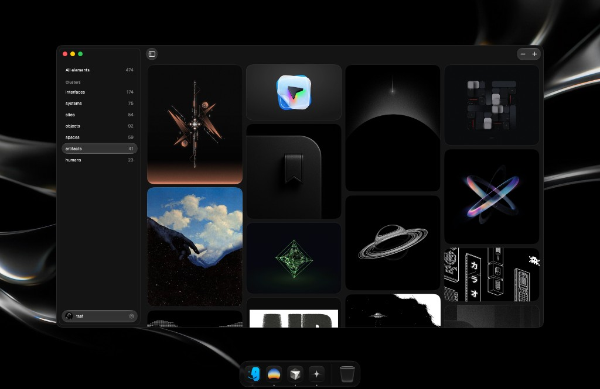

<p align="center">
  
</p>

<h1 align="center">Odyssey</h1>

<p align="center">
  
</p>

<br />

An unofficial [Cosmos](https://cosmos.so) client. Two things:

- **API** — a simple Cosmos API for any profile or cluster. Live at [odyssey-hq.vercel.app](https://odyssey-hq.vercel.app). See [apps/web](apps/web/README.md).
- **Mac app** — a native macOS app to browse Cosmos from your desktop. It runs on the API. See [apps/mac](apps/mac/README.md).

No auth, so public elements only.

## Download

Grab the Mac app from the [latest release](https://github.com/traf/odyssey/releases/latest) — open the DMG, drag to Applications, done. It's signed and notarized so it just opens. Needs macOS 26+.

## Structure

```
odyssey/
├── apps/
│   ├── web/   # Next.js — the API + web frontend
│   └── mac/   # SwiftUI Mac app (runs on the API)
└── package.json   # npm workspaces
```

## API

```bash
# All images from a profile
GET https://odyssey-hq.vercel.app/api/{username}

# Images from a cluster
GET https://odyssey-hq.vercel.app/api/{username}/{cluster}
```

```bash
curl https://odyssey-hq.vercel.app/api/traf/systems
# { "images": ["https://cdn.cosmos.so/...", ...], "count": 75 }
```

Full docs in [apps/web](apps/web/README.md).

## Contributing

Users don't need any of this — just download the app above. To hack on it:

```bash
npm install       # install web deps (workspaces)
npm run dev       # run the web app

cd apps/mac && swift run   # run the mac app
```

See each app's README for details.

---

An unofficial client for Cosmos. Not affiliated with or endorsed by Cosmos. All content and trademarks belong to their respective owners.
