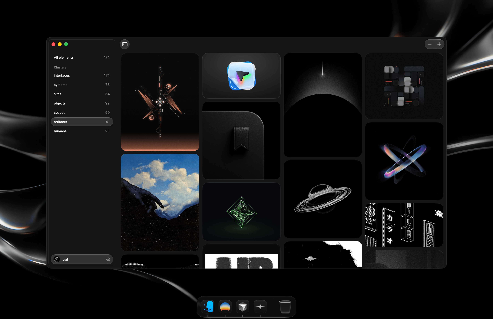

  
  <h2>Odyssey Mac</h2>

 

  

 

A native SwiftUI macOS app to browse [Cosmos](https://cosmos.so) galleries, powered by the Odyssey [API](../web).

No auth, so public elements only

## Install

Download `Odyssey.dmg` from the [latest release](https://github.com/traf/odyssey/releases/latest), open it, and drag **Odyssey** to Applications. That's it — it's signed and notarized so it just opens, no terminal or setup needed. Needs macOS 26+.

## Features

- Search any username; your profile sticks around across launches.
- Cluster sidebar with counts; account modal to switch profile or sign out.
- Masonry grid with infinite scroll and a smooth full-screen image zoom.
- Trackpad haptics on every interaction.
- Shortcuts (also listed in the account modal): ⌘, settings, ⌘S sidebar, ⌘Z Zen mode (hides everything but the images), ⌘+/⌘− zoom the grid (1–6 columns), ⌘0 resets.

## Contributing

Just want to use it? See Install above — no need to build anything.

To hack on it: `swift run`, or open `Package.swift` in Xcode and hit Run. It targets `https://odyssey-hq.vercel.app`; to hit a local API, edit `baseURL` in `Sources/Odyssey/API.swift`.

## Release

`scripts/release.sh [version]` does the whole thing: builds the release binary, assembles `Odyssey.app`, signs with Developer ID, notarizes, staples, and spits out `dist/Odyssey.dmg`. Then upload that DMG to a GitHub release (the web "Download for Mac" button points at `releases/latest`). Signing creds live in `.env.release` (gitignored).

## Architecture

- `Theme.swift` — design tokens (color, font, spacing). Single source of truth; edit here, not in views.
- `GalleryModel.swift` — `@Observable` state and data loading.
- `API.swift` / `Models.swift` — web API client and types.
- Views are small, one-word components: `Splash`, `Sidebar`, `Gallery`, `Masonry`, `Lightbox`, `Modal`, `Account`, `SearchField`, `Button`, `IconButton`, `Shortcut`, `Avatar`, `Glass`, `Logo`, `CosmosMark`, `Spinner`.
- `Button` is the glass-capsule action button (same height as `SearchField`); it shadows SwiftUI's `Button`, so use `SwiftUI.Button` for native menu commands.
- `Modal` is a reusable dimmed-backdrop card (click outside or Esc to dismiss); `IconButton` is the reusable circular glass icon control (matches the native sidebar toggle).
- Loading is always the spinning Cosmos mark (`Spinner`), never a system `ProgressView`.
- Haptics go through the `Haptic` helper; fire it on every discrete interaction.
- The last username persists in `UserDefaults`; `restore()` reloads it on launch.
